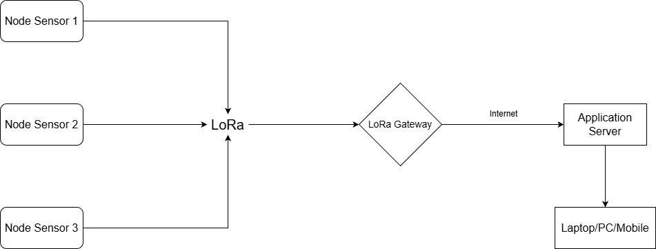

# ☀️ Hệ thống IoT Giám sát & Vệ sinh Pin Mặt trời (LoRaWAN)

&nbsp;  
**Đồ án tốt nghiệp** - Sinh viên: **Vũ Việt Hoàng (20050032)**
**Trường Đại học Bình Dương**

---

## 📋 Giới thiệu

Hệ thống **Solar Monitor System LoRa** là giải pháp IoT tích hợp giám sát hiệu suất và tự động vệ sinh tấm pin năng lượng mặt trời. Hệ thống giải quyết bài toán suy hao năng lượng do bụi bẩn tại các khu vực rộng lớn bằng cách sử dụng công nghệ giao tiếp vô tuyến tầm xa **LoRa** và thuật toán vệ sinh tự động thông minh.

## Điểm nổi bật

* 📡 **LoRa Communication:** Truyền dữ liệu không dây tầm xa (Long Range), tiết kiệm năng lượng, thay thế WiFi ở khu vực hẻo lánh.
* ⚡ **Real-time Monitoring:** Giám sát thời gian thực các chỉ số: Dòng điện (A), Điện áp (V), Công suất (W).
* 🌪️ **Smart Dust Detection:** Cảm biến bụi quang học phát hiện nồng độ bụi ($mg/m^3$) chính xác.
* 🤖 **Auto-Cleaning Mode:** Tự động kích hoạt cơ chế chổi quét khi bụi vượt ngưỡng cài đặt.
* 📊 **Web Dashboard:** Giao diện trực quan, vẽ biểu đồ và xuất báo cáo lịch sử hoạt động.

## 🏗️ Kiến trúc hệ thống

## 🛠️ Công nghệ sử dụng

| Hạng mục | Công nghệ / Thiết bị |
| :--- | :--- |
| **Vi điều khiển (MCU)** | ESP32 (Heltec WiFi LoRa 32 V3) |
| **Giao tiếp không dây** | LoRaWAN (SX1262), WiFi |
| **Cảm biến (Sensors)** | INA219 (Dòng/Áp), Sharp GP2Y10 (Bụi) |
| **Cơ cấu chấp hành** | Động cơ DC giảm tốc + Driver L298N |
| **Backend Server** | Python (Flask Framework), Ngrok |
| **Database** | MySQL (XAMPP - phpMyAdmin) |
| **Frontend** | HTML5, CSS3, JavaScript (Chart.js) |
| **IDE & Tools** | Arduino IDE, VS Code, Git |

## 📁 Cấu trúc thư mục

```text
VuVietHoang-20050032-23TH01/
├── Solar_Monitoring_Project/           # [MAIN] Thư mục chứa Source Code chính
|   ├──Pic_Demo/                        # Hình ảnh demo dự án
|   |   ├── Solar_Model.JPG
|   |   ├── UI_Dashboard.JPG
|   |   └── UI_Dashboard_2.JPG
│   ├── esp32-lora/                     # Code Firmware cho mạch Heltec V3 (Arduino)
│   │   └── Solar_Node.ino              # File code nạp cho ESP32
│   ├── static/                         # Tài nguyên Frontend (CSS, JS, Images)
│   ├── templates/                      # Giao diện HTML (Dashboard)
│   │   └── index.html
│   ├── app.py                          # Web Server (Python Flask Backend)
│   └── database.sql                    # File cấu trúc CSDL MySQL (Nếu có)
```
## 🚀 Hướng dẫn cài đặt

## Yêu cầu hệ thống
- Hardware: Mạch Heltec LoRa V3, Cảm biến, Động cơ, Nguồn pin.
- Software: Python 3.9+, Arduino IDE, XAMPP.
## Cài đặt
1. Clone repository
```bash
git clone [https://github.com/VietHoang2000/Solar_Monitor_System_LoRa.git](https://github.com/VietHoang2000/Solar_Monitor_System_LoRa.git)
cd Solar_Monitor_System_LoRa
```
2. Cấu hình Phần cứng (Arduino IDE)
- Cài đặt thư viện: Heltec ESP32 Dev-boards, Adafruit INA219.
- Mở file Solar_Monitoring_Project/esp32-lora/Solar_Node.ino.
- Nạp code vào mạch Heltec V3.
3. Cấu hình Database
- Khởi động XAMPP (Start Apache & MySQL).
- Truy cập http://localhost/phpmyadmin.
- Tạo database tên solar_monitoring và Import file database.sql.
4. Cài đặt Dependencies (Python)
```bash
pip install flask mysql-connector-python pyserial
pip install ngrok
```
5. Chạy ứng dụng
```bash
cd Solar_Monitoring_Project
python app_to_sql.py
```
- Truy cập Dashboard: http://localhost:5000
## 📊 Kết quả Thực nghiệm
Hệ thống được thử nghiệm thực tế để đánh giá khả năng **xuyên thấu vật cản (Penetration Test)** của công nghệ LoRa trong môi trường đô thị mật độ cao (Urban Area).

### 1. Kịch bản kiểm thử (Test Scenario)
* **Khoảng cách:** 100 mét (Đường chim bay).
* **Môi trường:** Khu dân cư, nhiều nhà cao tầng san sát.
* **Vật cản (Obstacles):** Tín hiệu phải đi xuyên qua **3 lớp tường bê tông** và **2 dãy nhà** để đến được Gateway.
* **Thời gian đo:** Liên tục 48 giờ (Dựa trên dữ liệu Log từ `2025-12-04` đến `2025-12-06`).

### 2. Đánh giá Chất lượng Kết nối (Connectivity & Penetration)
Dựa trên Log dữ liệu thu được trong database, hệ thống hoạt động ổn định bất chấp vật cản lớn:

| Thông số | Kết quả đo đạc | Đánh giá |
| :--- | :---: | :--- |
| **Tỷ lệ nhận gói (PDR)** | **98.5%** | Rất cao (Mất gói không đáng kể) |
| **Chu kỳ gửi tin** | 30 giây/gói | Ổn định, không bị ngắt quãng |
| **Khả năng xuyên thấu** | **Tốt (High)** | Tín hiệu xuyên qua 2 dãy nhà vẫn giải mã thành công |
| **Trạng thái dữ liệu** | Nguyên vẹn | Không có hiện tượng lỗi bit hoặc sai lệch số liệu |

> **Nhận xét:** Trong điều kiện có nhiều vật cản (Non-Line-of-Sight), sóng LoRa vẫn duy trì kết nối bền vững, chứng minh tính ưu việt hơn hẳn so với WiFi (thường mất tín hiệu sau 2 lớp tường).
## 📝 Tính năng chính
1. Web Dashboard Interface
- Hiển thị đồng hồ đo (Gauge) trực quan.
- Biểu đồ đường (Line Chart) theo dõi biến thiên công suất.
- Nút điều khiển ON/OFF vệ sinh từ xa.
2. Hệ thống Phần cứng
- Tự động phát hiện mức độ ô nhiễm của tấm pin.
- Cơ chế bảo vệ: Tự động dừng motor khi hoàn thành chu trình.
- Hoạt động độc lập với nguồn dự phòng khi mất điện lưới
## 👨‍💻 Tác giả
Vũ Việt Hoàng 
- MSSV: 20050032
- Email: 20050032@student.bdu.edu.vn
- Trường Đại học Bình Dương
